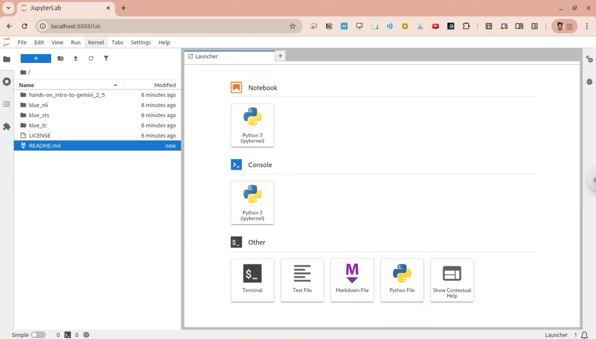

# LLM Benchmarks for Asian Languages

## Install Anaconda
Install Anaconda. For details, see [INSTALL-CONDA.md](INSTALL-CONDA.md).

## Create a new conda environment `klue`
```bash
conda create -n klue python=3 anaconda
conda activate klue
```
For example,
```bash
(base) aimldl@tkim-glinux:~$ conda activate klue
(klue) aimldl@tkim-glinux:~$
```

To deactivate an active environment, run:                
```bash                                                                                                            conda deactivate 
```
## Activate the `klue` environment
```bash
(base) $ conda activate klue
(klue) $
```

For example,
```bash
(base) aimldl@tkim-glinux:~$ conda activate klue
(klue) aimldl@tkim-glinux:~$
```

## Launch Jupyter Lab
`cd` into the project directory. For example, `~/github/aimldl/llm_benchmarks_asian_langs`. And launche Jupyter Lab.

```bash
(klue) $ cd ~/github/aimldl/llm_benchmarks_asian_langs
(klue) $ jupyter lab
```


For example,
```bash
(klue) aimldl@tkim-glinux:~$ cd ~/github/aimldl/llm_benchmarks_asian_langs
(klue) aimldl@tkim-glinux:~/github/aimldl/llm_benchmarks_asian_langs$ jupyter lab
```

To cancel Jupyter Lab, press Ctrl+C twice.

## Run the KLUE benchmarks
Open `run_klue.ipynb` and run the notebook.
